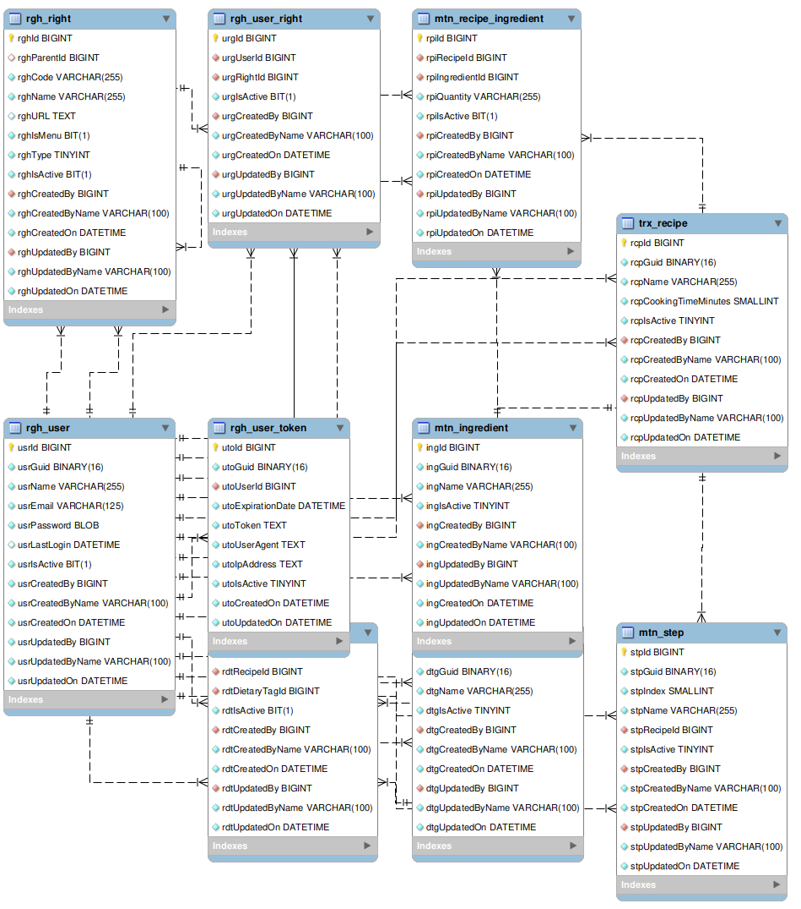

# Recipe Share

A simple full-stack recipe sharing system.
It includes a secure .NET Core 8.0 Web API with JWT authentication, a React TypeScript web front-end, and a MySQL database.
The app demonstrates realistic CRUD operations for recipes, ingredients, dietary tags, and steps, plus user login/register, deployed using Azure, Google Cloud, and Firebase Hosting.

---

| Resource                             | Link                                                                                                                    |
| ------------------------------------ | ----------------------------------------------------------------------------------------------------------------------- |
| **YouTube Demo Video**               | [YouTube Demo Video](https://youtu.be/DGvB1V9QRJg)                                                                      |
| **YouTube Demo Video (Unedited)**    | [YouTube Demo Video (Unedited)](https://youtu.be/lgSLFYP33c4)                                                           |
| **Firebase Hosted Web App**          | [Visit Web App](https://recipeshare-williamsykes.web.app)                                                               |
| **Azure Deployed API Swagger**       | [API Swagger Docs](https://recipesharewebapi-a8fgg5atajb0gvdr.southafricanorth-01.azurewebsites.net/swagger/index.html) |

---

## ERD Diagram



---

## BenchmarkDotNet Summary Table
``` ini

BenchmarkDotNet=v0.13.5, OS=ubuntu 20.04
Intel Core i9-9980HK CPU 2.40GHz, 1 CPU, 16 logical and 8 physical cores
.NET SDK=8.0.404
  [Host]     : .NET 8.0.11 (8.0.1124.51707), X64 RyuJIT AVX2
  Job-JEOVOY : .NET 8.0.11 (8.0.1124.51707), X64 RyuJIT AVX2

IterationCount=500  LaunchCount=1  WarmupCount=1

```
|                       Method |    Mean |    Error |   StdDev |   Median | Allocated |
|----------------------------- |--------:|---------:|---------:|---------:|----------:|
| SequentialGetRecipes500Times | 1.009 s | 0.0209 s | 0.1377 s | 0.9566 s | 137.68 KB |

---

## Setup Instructions

### Prerequisites

- [.NET Core SDK 8.0](https://dotnet.microsoft.com/en-us/download/dotnet/8.0)
- [MySQL Server](https://dev.mysql.com/downloads/mysql/) installed locally
- [Node.js and npm](https://nodejs.org/en/download/) installed for the React app

---

### Backend (.NET Core 8.0 API)

1. Ensure MySQL Server is running locally.
2. Create and seed the database by running the following SQL scripts in order:
   - `SQLScripts/1 - user.sql`
   - `SQLScripts/2 - recipe.sql`
   - `SQLScripts/3 - seed.sql` (Take note of the email address and password of the user - alter them or register a user through the web app before seeding the rest of the data. **Note: At least one user must exist to seed the data**)
3. Update the connection string in `appsettings.Development.json` if needed to match your MySQL setup.
4. Run the backend API with:
   ```bash
   dotnet run --project ./RecipeShareWebApi/RecipeShareWebApi.csproj
   ```
5. The API will start on the configured port, `https://localhost:5015` and the Swagger is accessible at `http://localhost:5015/swagger/index.html`

---

### Frontend (React TypeScript Web App)

1. Navigate to the web app directory:
   ```bash
   cd recipe-share-web
   ```
2. Install dependencies:
   ```bash
   npm install
   ```
3. Run the development server:
   ```bash
   npm start
   ```
4. The app will open in your browser, `http://localhost:8080`.

---

## Notes

- Make sure both backend API and MySQL are running before starting the frontend to ensure data fetching works.
- You can customize ports and connection strings in the respective config files if needed.